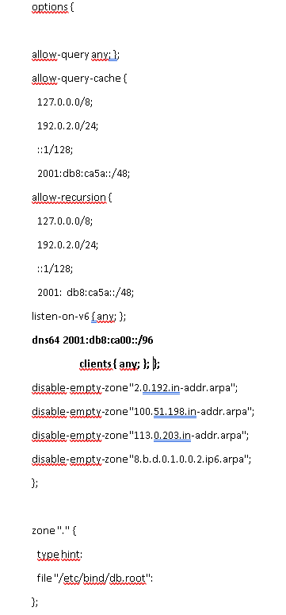
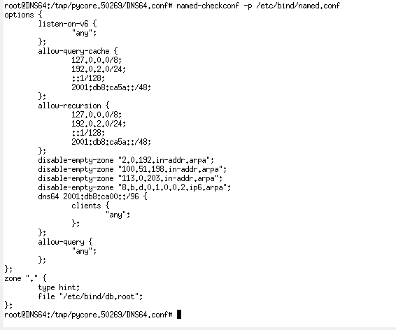
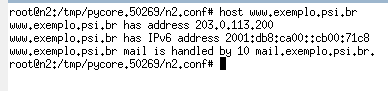

# Transicao para ipv6
Esse tutorial tem o objetivo de auxiliar na execução dos testes práticos das técnicas de transição abaixo.
- Pilha Dupla
- Serviço de Tunnel Broker (Tunelamento)
- Túnel 6to4 (Tunelamento)
- NAT64 (Tradução)

Primeiramente será preciso baixar os programas abaixo:
- [Oracle VirtualBox](https://download.virtualbox.org/virtualbox/6.1.22/VirtualBox-6.1.22-144080-Win.exe)
- [Baixar VM](https://ipv6.br/downloads/CursoIPv6br-CORE4.6-20150318.ova)

## Importar Máquina Virtual
- Instalar o software Oracle VirtualBox
- Abrir o Oracle VirtualBox
- Clicar em Arquivo > Importar Appliance
- Selecionar a VM baixada, avançar os passos, e clicar em importar.

## Habilitar importar arquivos da Máquina Física para Máquina Virtual
- Clicar em iniciar, para abrir o ambiente que será usado nos testes
- Ir na aba Dispositivos > Área de Transferência Compartilhada > Bi-direcional
- Ir na aba Dispositivos > Arastar e Soltar > Bi-direcional

## Ajustar tamanho da tela
- Clicar em Dispositivos > Inserir imagem de CD dos adicionais para convidado
- Na VM > clicar em iniciar > File Manager > VBox_GAs_6.1.22
- Na VM > ir para Área de Trabalho > abrir Terminal Emulador
- Executar o comando abaixo:
```bash
sudo su -
```
O comando acima solitara uma senha, digitar **ipv6br**
- Executar o comando abaixo:
```bash
cd /media/VBox_GAs_6.1.22
./VBoxLinuxAdditions.run
reboot
```
- A VM reiniciará
- Na VM > clicar em iniciar > Settings > Display > em "Resolution" mudar para resolução do seu monitor

## Pilha Dupla
- Baixar arquivo pilha_dupla.imn
- Arrastar arquivo baixado para VM
- Abrir arquivo pilha_dupla.imn
- Clicar no Play
- Clicar duas vezes no pc3, para abrir o terminal
- Digitar: ```ping6 2001:db8:0::20```
- Esperar uns 5 segundos e parar execução
- Em packet loss deve aparecer 0%
- Digitar: ```ping 192.168.1.20```
- Esperar uns 5 segundos e parar execução
- Em packet loss deve aparecer 0%

## Tunnel Broker
- Baixar o arquivo tunnel_broker.imn
- Arrastar arquivo baixado para VM
- Abrir o tunnel_broker.imn
- Clicar no Play
- Clicar duas vezes no pc1, para abrir o terminal
- Digitar os comandos abaixo:
```
ip addr add 2001:db8:2::2 dev lo
ip tunnel add to1234 mode sit ttl 64 remote 192.0.1.1 local 192.0.2.20
ip link set dev to1234 up
ip -6 route add 2001:db8:2::1 dev to1234
ip -6 route add ::/0 dev to1234
```
- Clicar duas vezes no rTunnelBroker
- Digitar os comandos abaixo:
```
ip addr add 2001:db8:2::1 dev lo
ip tunnel add toABCD mode sit ttl 64 remote 192.0.2.20 local 192.0.1.1
ip link set dev toABCD up
ip -6 route add 2001:db8:2::2 dev toABCD
ping6 2001:db8:2::2
```
- Em pc1, digitar o comando abaixo:
```
ping6 2001:db8:2::1
ping6 2001:db8::20
```
## NAT64
- Baixar o arquivo NAT_64.imn
- Arrastar arquivo baixado para VM
- Abrir arquivo NAT_64.imn
- Clicar no Play
- Clicar duas vezes no rNAT64, para abrir o terminal
- Digitar os comandos abaixo no terminal:
```
touch tayga.conf

echo tun-device nat64 >> tayga.conf
echo ipv4-addr 192.0.2.1 >> tayga.conf
echo prefix 2001:db8:2::/96 >> tayga.conf
echo dynamic-pool 192.0.2.0/24 >> tayga.conf
echo data-dir /tmp >> tayga.conf
echo map 192.0.2.2 2001:db8:0::20 >> tayga.conf

tayga --mktun

ip link set nat64 up
ip route add 192.0.2.0/24 dev nat64
ip -6 route add 2001:db8:2::/96 dev nat64

iptables -t nat -A POSTROUTING -o eth0 -j MASQUERADE
iptables -A FORWARD -i eth0 -o nat64 -m state --state RELATED,ESTABLISHED -j ACCEPT
iptables -A FORWARD -i nat64 -o eth0 -j ACCEPT

tayga -d -c tayga.conf

```
- Abrir host pc1 e digitar os comandos abaixo:
```
ping6 -c 4 2001:db8:2::192.0.0.20
```
- Em packet loss deve aparecer 0%

- Digitar o comando abaixo em pc1:
```
host 192.0.0.20
```
- O comando acima irá revelar que a url do servidor servidorDestino é **www.exemplo.psi.br**
- Digitar o comando abaixo em pc1:
```
ping6 -c 4 www.exemplo.psi.br
```
- Em packet loss deve aparecer **unknown host**

- Abrir o servidor DNS64 e digitar o comando abaixo:
```
vi /etc/bind/named.conf
```
- Apertar letra **I** do teclado, para editar arquivo
- Acrescentar conteudo em negrito da forma mostrada abaixo:



- Apertar tecla **ESC** do teclado
- Digitar **:x** para salvar e sair do editor

- Digitar comando abaixo:
```
named-checkconf -p /etc/bind/named.conf
```
- Deve ser exibido um resultado igual ao mostrado abaixo:


- Executar os comandos abaixo:
```
killall named

named -c /etc/bind/named.conf
```
- Abra host pc1, e execute o comando abaixo:
```
host www.exemplo.psi.br
```
- Deve ser exibido um resultado igual ao mostrado abaixo:


- Digitar o comando abaixo:
```
ping6 -c 4 www.exemplo.psi.br
```

## Túnel 6to4
- Baixar arquivo 6to4.imn
- Arastar arquivo baixado para VM
- Clicar no Play
- Clicar duas vezes no pc1
- Executar o comando abaixo:
```
ping6 2001:db8:0::20
```
- Em packet loss deve aparecer 100%
- Ainda no pc1, executar os comandos abaixo:
``` 
ip addr add 2002:CB00:7101::1 dev  lo
ip tunnel add to1234 mode sit ttl 64 remote 192.88.99.1 local 192.168.0.20
ip link set dev to1234 up
ip -6 route add 2002:CB00:7101::2 dev to1234
ip -6 route add ::/0 dev to1234
```
- No relay6to4 digitar os comandos abaixo:
```
ip addr add 2002:CB00:7101::2 dev lo
ip tunnel add toABCD mode sit ttl 64 remote 192.168.0.20 local 192.88.99.1
ip link set dev  toABCD up
ip -6 route add 2002:CB00:7101::1 dev toABCD
ping6 2002:CB00:7101::1
```
- Em packet loss deve aparecer 0%
- Clicar duas vezes no pc1
- Executar o comando abaixo:
```
ping6 2001:db8:0::20
```
- Em packet loss deve aparecer 0%

